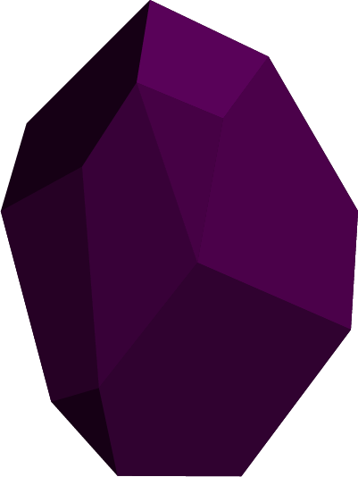

<div id="top"></div>

[![Contributors][contributors-shield]][contributors-url]
[![Forks][forks-shield]][forks-url]
[![Stargazers][stars-shield]][stars-url]
[![Issues][issues-shield]][issues-url]
[![MIT License][license-shield]][license-url]
[![LinkedIn][linkedin-shield]][linkedin-url]


<!-- PROJECT LOGO -->
<br />
<div align="center">
  <a href="https://github.com/0xCompyler/obsidian-server">
    
  </a>

  <h3 align="center">obsidian</h3>

  <p align="center">
    Making education streamlined, accessible, engaging and organized.  
    <br />
    <a href="https://github.com/0xCompyler/obsidian-server"><strong>Explore the docs »</strong></a>
    <br />
    <br />
    <a href="https://github.com/0xCompyler/obsidian-server">View Demo</a>
    ·
    <a href="https://github.com/0xCompyler/obsidian-server/issues">Report Bug</a>
    ·
    <a href="https://github.com/0xCompyler/obsidian-server/issues">Request Feature</a>
  </p>
</div>


<!-- TABLE OF CONTENTS -->
<details>
  <summary>Table of Contents</summary>
  <ol>
    <li>
      <a href="#about-the-project">About The Project</a>
      <ul>
        <li><a href="#built-with">Built With</a></li>
      </ul>
    </li>
    <li>
      <a href="#getting-started">Getting Started</a>
      <ul>
        <li><a href="#prerequisites">Prerequisites</a></li>
        <li><a href="#installation">Installation</a></li>
      </ul>
    </li>
    <li><a href="#features">Features</a></li>
    <li><a href="#contributing">Contributing</a></li>
    <li><a href="#license">License</a></li>
    <li><a href="#contact">Contact</a></li>
    <li><a href="#acknowledgments">Acknowledgments</a></li>
  </ol>
</details>


<!-- ABOUT THE PROJECT -->
## About The Project


This pandemic has brought us an **hybrid mode** of education which has been a makeshift solution but **not a very smooth and engaging one**.

Social media trends regarding this mode of education is a good indicator of it's ineffectiveness, our experience with it has been very chaotic as well.

Tools for teaching and assessment will help teachers to focus more on teaching and less on organizing details and keeping a track on the performance of students. 

<p align="right">(<a href="#top">back to top</a>)</p>


### Built With


<p align="left">


</p>

<p align="right">(<a href="#top">back to top</a>)</p>


<!-- GETTING STARTED -->
## Getting Started

This is an example of how you can generate your own collaborative recommendation engine.
To get a local copy up and running follow these simple example steps.

### Prerequisites

* Python>=3.7


### Installation

1. Clone the repo
   ```sh
   git clone https://github.com/0xCompyler/obsidian-server.git
   ```
2. Create and activate virtual environment
   ```sh
   python3 -m venv venv
   source venv/bin/activate
   ```
3. Install the requirements
   ```sh
   python3 -m pip install -r requirements.txt
   ```
4. Start uvicorn server
   ```sh
   uvicorn src.main:app
   ```

<p align="right">(<a href="#top">back to top</a>)</p>


<!-- USAGE EXAMPLES -->
## Features

### Plagiarism Detection

Often, one educator is responsible for evaluating assignments of around 120 students (2 batches of 60 students). In such cases, detecting plagiarism by a human is a up hill task which also requires a lot of time. In order to solve this problem, we thought of computerizing the entire process of plagiarism checking, and yes it works on handwritten assignments too!

We used TF-IDF to vectorize the documents and then calculated the cosine similarity between them to check for potential plagiarism.


### Automatic Keyword Checker

As mentioned earlier, checking assignments, specially handwritten ones can become a tedious task. In order to further simplify the lives of teachers, we have come up with an automatic keyword checker which verifies the presence of certain keywords in the assignment. This will if not completely erradicate manual verification, simplify the process of evaluation to a great extent.

### Video Transcription

Taking notes during online class is often difficult. That's why we came up with a solution to help students by using IBM Watson's Speech to text service to automatically generate closed captions for every class recording.

### Integrated Video Conferencing

### Attendance Monitoring

### Performance Monitoring


<p align="right">(<a href="#top">back to top</a>)</p>


<!-- ROADMAP -->

See the [open issues](https://github.com/0xCompyler/obsidian-server/issues) for a full list of proposed features (and known issues).

<p align="right">(<a href="#top">back to top</a>)</p>


<!-- CONTRIBUTING -->
## Contributing

Contributions are what make the open source community such an amazing place to learn, inspire, and create. Any contributions you make are **greatly appreciated**.

If you have a suggestion that would make this better, please fork the repo and create a pull request. You can also simply open an issue with the tag "enhancement".
Don't forget to give the project a star! Thanks again!

1. Fork the Project
2. Create your Feature Branch (`git checkout -b feature/AmazingFeature`)
3. Commit your Changes (`git commit -m 'Add some AmazingFeature'`)
4. Push to the Branch (`git push origin feature/AmazingFeature`)
5. Open a Pull Request

<p align="right">(<a href="#top">back to top</a>)</p>


<!-- LICENSE -->
## License

Distributed under the MIT License. See `LICENSE.txt` for more information.

<p align="right">(<a href="#top">back to top</a>)</p>


<!-- CONTACT -->
## Contact

Arijit Roy - [@your_twitter](https://twitter.com/__radioactive11__) - roy.arijit2001@gmail.com

Project Link: [https://github.com/0xCompyler/obsidian-server](https://github.com/0xCompyler/obsidian-server)

<p align="right">(<a href="#top">back to top</a>)</p>


<!-- ACKNOWLEDGMENTS -->
## Acknowledgments

* [BiVAECF](https://dl.acm.org/doi/pdf/10.1145/3437963.3441759)
* [IBPR](https://www.hadylauw.com/publications/cikm17a.pdf)


<p align="right">(<a href="#top">back to top</a>)</p>


<!-- MARKDOWN LINKS & IMAGES -->
<!-- https://www.markdownguide.org/basic-syntax/#reference-style-links -->
[contributors-shield]: https://img.shields.io/github/contributors/0xCompyler/obsidian-server.svg?style=for-the-badge
[contributors-url]: https://github.com/0xCompyler/obsidian-server/graphs/contributors
[forks-shield]: https://img.shields.io/github/forks/0xCompyler/obsidian-server.svg?style=for-the-badge
[forks-url]: https://github.com/0xCompyler/obsidian-server/network/members
[stars-shield]: https://img.shields.io/github/stars/0xCompyler/obsidian-server.svg?style=for-the-badge
[stars-url]: https://github.com/0xCompyler/obsidian-server/stargazers
[issues-shield]: https://img.shields.io/github/issues/0xCompyler/obsidian-server.svg?style=for-the-badge
[issues-url]: https://github.com/0xCompyler/obsidian-server/issues
[license-shield]: https://img.shields.io/github/license/0xCompyler/obsidian-server.svg?style=for-the-badge
[license-url]: https://github.com/0xCompyler/obsidian-server/blob/master/LICENSE
[linkedin-shield]: https://img.shields.io/badge/-LinkedIn-black.svg?style=for-the-badge&logo=linkedin&colorB=555
[linkedin-url]: https://linkedin.com/in/arijit--roy
[product-screenshot]: images/screenshot.png